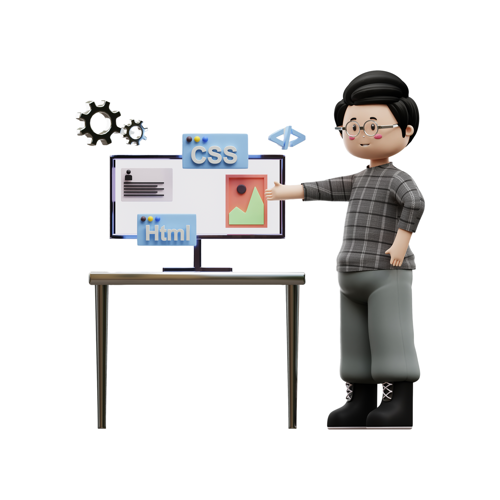

<h1 align="center">Hi, I'm Trọng Sơn.</h1></h1> 
<!--  -->

<div align="center">
  
</div>

```typescript
 const TrongSon = {
  name: "Ho Trong Son",
  age: 23,
  email: "hotrongsonit@gmail.com",
  pronouns: "he/him",
  hobbies: ["volleyball", "programming", "music", "romantic film"],
  programminLanguages: ["Javascript", "Typescript"]
 } as const
```

## ✍️ **Contact me:** 💬

[](https://www.linkedin.com/in/tr%E1%BB%8Dng-s%C6%A1n-h%E1%BB%93-635742285/)
[](https://twitter.com/Jason42875495)
[](https://www.facebook.com/profile.php?id=100032736788526)
[](https://www.instagram.com/trongson_99/)
[](https://leetcode.com/sonht113/)
[](https://github.com/sonht113)


## 🔭 **Languages - Packages - Library - Framework:** 💻


## ♻️ **Linter:** ✅


## 🔭 **Other:** 💻


<!-- ## 📊 **Github Stats** 💻 -->

  <!-- <summary><b>💻 GitHub Profile Stats</b></summary>
  <br/>
  <div display="flex" align="center">
     
    
    
    <br/>
    &nbsp;	  
    <br/>
  </div>
</div>
     
[Snake animation](https://github.com/sonht113/sonht113/blob/output/github-contribution-grid-snake.svg)
     
<h2 align="center"><i>Created by @Jason on March 31th, 2022<i></h2> -->
